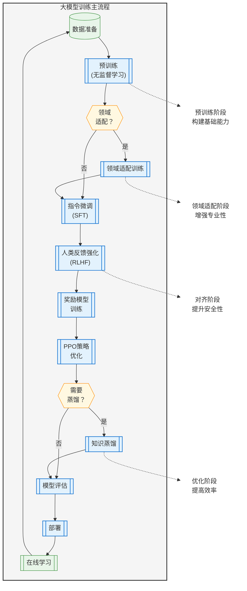

# 
NLP领域的难题：虽然语料库很丰富，但是都是无标注数据，所以依赖标注数据的监督学习的模型训练方式受到限制。
研究者提出了两阶段的训练方法：
1. 在大量无标注数据上做自监督的预训练（pre-train）->有基本的语义理解能力。
2. 在下游任务有标注的数据中进行微调（fine-tunning）->提升模型解决特定任务的性能。

## 训练阶段全流程梳理
1. 预训练（Pretraining）
- 时间定位：起点，占总体时间的70%-90%。
- 依赖关系：无前置依赖，但需准备海量数据（可能与其他阶段数据准备并行）。
- 变体：
    - 多阶段预训练：先训练通用数据，再注入领域数据（如PubMed或代码）。
    - 课程学习：逐步增加数据复杂度。

2. 后预训练（Post-Pretrain）
    1. 领域自适应（Domain Adaptation）
        - 目标：使模型适应特定领域（如医疗、法律）。
        - 时间：可在预训练后直接进行，或与微调交替。
        - 方法：继续预训练（轻量版）+ 领域数据混合。`
    2. 有监督微调（Supervised Fine-Tuning, SFT）
        - 目标：通过指令数据调整模型行为。
        - 时间：必须在预训练/领域自适应之后，RLHF之前。
    3. 人类反馈强化学习（RLHF）
        - 子阶段：
            - 奖励模型训练（1-3天）：依赖人类偏好数据。
            - PPO优化（1-2周）：迭代优化策略模型。
        - 时间：必须在SFT之后，但可与数据收集并行。
    4. 模型蒸馏（Distillation）（可选）
        - 目标：将大模型压缩为小模型。
        - 时间：所有训练完成后，或与RLHF并行（若蒸馏RLHF模型）。
    5. 持续学习（Continual Learning）
        - 目标：模型部署后的动态更新。
        - 时间：循环触发，可能与其他阶段重叠（如新数据触发重新预训练）。

## GPT1训练框架

语言建模：通过一定方法进行语言模型的训练
### 1.无标签数据的自监督学习
    自监督学习(SSL, Self-Supervised Learning)是一种特殊形式的无监督学习，它通过设计"前置任务"(pretext task)从数据本身自动生成标签，而不需要人工标注。
    L1= max∑logP(xt∣x<t)
根据序列中每个词前面的所有词的子序列，进行词向量编码和加入位置信息编码得到第一层的输入。
然后通过n层解码器一直线性传递，最后一层经过softmax求出下一个词的概率。

### 2.有标签数据的监督学习

在自监督预训练后，GPT 需要通过 监督微调（Supervised Fine-Tuning, SFT） 来适应具体任务。
有监督：根据输入x序列，预测y序列，目标还是让每一个位置根据之前的x序列，预测当前位置的y标签的似然估计最大。L2=max∑logP(yt∣x<t)
L=L1+r*L2
数据准备->数据编码->模型加载->微调训练