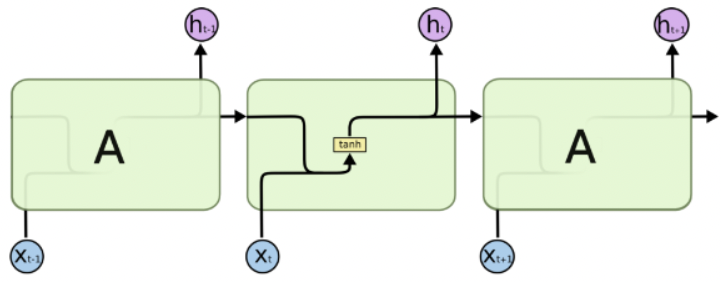
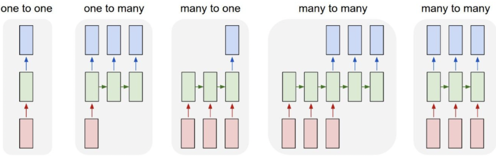
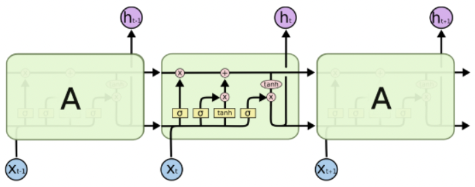
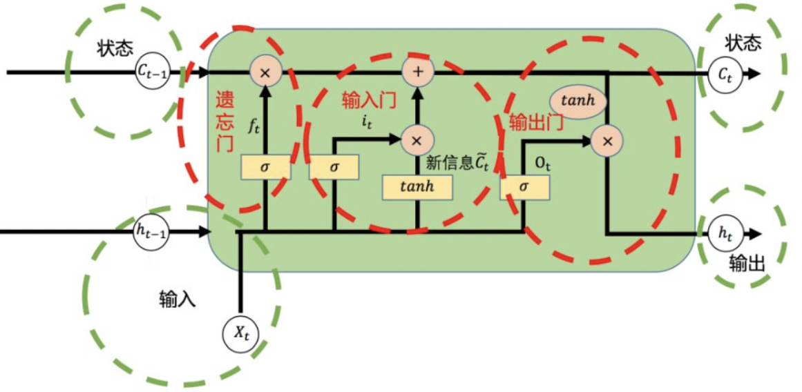

# 适合新手小白！本人学习CNN、RNN、LSTM的笔记
## 基本概念：
时间序列数据：在不同时间点上收集到的同类型的数据，这类数据反映了某变量随时间的变化情况。

## CNN
处理具有多维结构的数据而设计的深度学习模型,比如二位图像数据。
卷积层利用卷积核在数据上滑动进行卷积操作，提取局部特征，不同的卷积核可以捕捉到不同的特征模式，如边缘、纹理等；
池化层则对特征图进行下采样，减少数据量的同时保留重要特征，常见的池化方法有最大池化和平均池化；
最后通过全连接层将提取到的特征进行整合，用于分类或回归等任务.

## 时间序列数据

特点：
 - 时间依赖性：当前时刻的数据通常与过去时刻的数据相关。例如，今天的温度可能与昨天的温度相关。
 - 顺序性：数据点的顺序很重要，改变顺序会改变数据的意义。
 - 动态性：时间序列数据通常是动态变化的，可能包含趋势、周期性和噪声。

RNN、LSTM、GRU 是专门用于处理序列数据的神经网络模型,它们的核心特点是能够捕捉数据中的时间依赖关系。

Seq2Seq 是一种用于处理序列到序列映射问题的模型架构：将一个序列（如一句话）作为输入，生成另一个序列（如翻译后的句子）作为输出。
Seq2Seq 是一种更高层次的架构，可以使用 LSTM /RNN等作为其组件。
Seq2Seq 模型通常由两部分组成：
编码器（Encoder）：将输入序列编码为一个固定长度的上下文向量（Context Vector）。
解码器（Decoder）：根据上下文向量生成输出序列。

Seq2Seq 模型通常基于 RNN（如 LSTM 或 GRU）实现，但也可以使用 Transformer 等更先进的架构。

## RNN：Recurrent Neural Networks，循环神经网络
### 原理
时间上进行线性递归的神经网络，用于处理序列数据。
类似于一阶微分方程组：状态空间表达式。

### 缺点：
计算梯度时，t时刻的导数会传播到t-1，t-2，… ，1时刻，这样就有了连乘的系数，连乘带来了两个问题：梯度爆炸和消失。
    由于每个序列的计算都是递归乘积的，导致权重矩阵的多次连乘。
    当状态计算的权重矩阵whh的特征值<1时，连乘会趋于0；>1时，连乘会爆炸。
在前向过程中，开始时刻的输入对后面时刻的影响越来越小，这就是长距离依赖问题。

## LSTM
### 介绍
为解决RNN在处理长序列数据时容易出现的梯度消失和梯度爆炸问题而设计，通过引入输入门、遗忘门和输出门等特殊结构，能够更好地控制信息的流动和长期依赖关系的捕捉。

### 原理
通过“门”结构来删除或者增加信息到细胞状态cell state。
这个cell state承载着之前所有状态的信息，每到新的时刻，就有相应的操作来决定舍弃什么旧信息以及添加什么新信息。
ct作为信息的长期记忆载体,通过遗忘门和输入门的控制，能够灵活地决定保留哪些旧信息和添加哪些新信息，以及梯度裁剪方法，避免了rnn问题。
这个状态与隐藏层状态h不同，它的更新是缓慢的，而隐藏层状态h的更新是迅速的。
所以h快，c慢，所以叫长短期时间记忆。

输入门决定了当前输入有多少信息可以进入细胞状态；
遗忘门决定了上一时刻的细胞状态有多少信息需要被遗忘；
输出门则控制细胞状态中的信息如何输出到当前的隐藏状态和输出。
这些门控机制使得LSTM能够选择性地记住和遗忘信息，从而更有效地处理长序列数据。

torch.nn.LSTM 默认输出序列长度与输入序列长度相同，可以只取最后一个时间步的输出。

## 批量并行计算

并行计算：LSTM 的每个时间步会同时处理 batch_size 个样本。例如，如果 batch_size=32，那么 LSTM 会同时处理 32 个样本的相同时间步。
参数共享：LSTM 的参数（如权重矩阵和偏置）在所有样本之间是共享的。无论 batch_size 是多少，LSTM 的本质都是用同一套参数进行计算。

训练时的 batch_size 和测试时的 batch_size 可以不同。LSTM 的参数是固定的，与 batch_size 无关。   